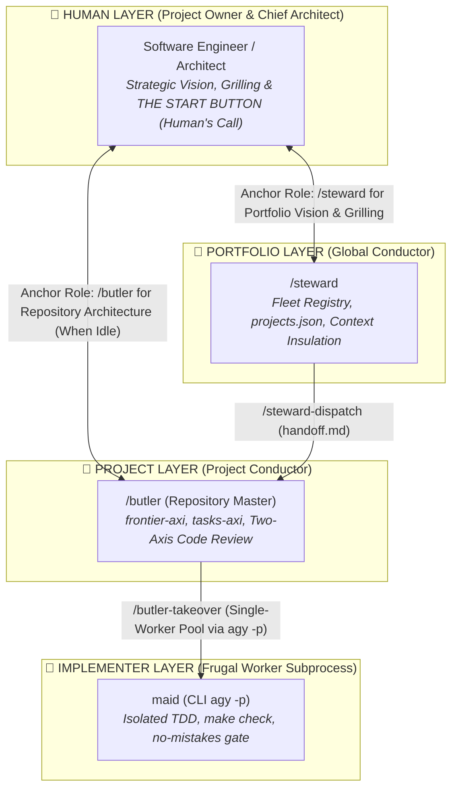
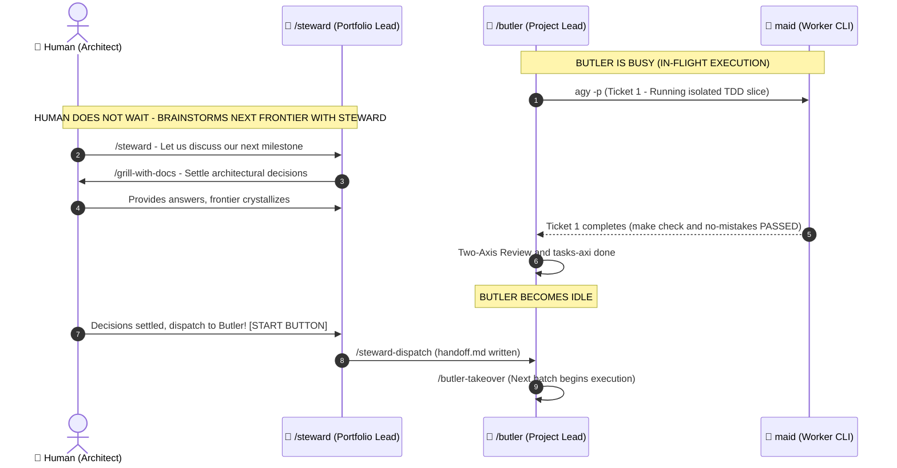
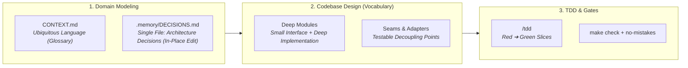
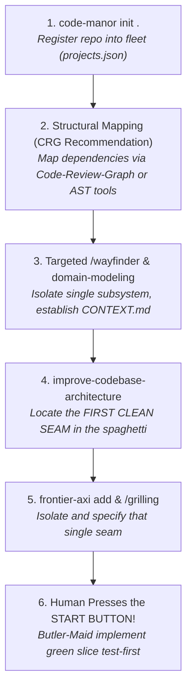

# 🏰 Code-Manor User Guide & Walkthrough: "Where Does the Human Fit In?"

> **Version:** 1.4 (Canonical User & Contributor Guide)  
> **Core Philosophy:** Unifying Matt Pocock's domain-driven design craft & deep modules with Kun Chen's L8 Principal AXI systems engineering and deterministic verification gates.

---

> [!TIP]
> 🎓 **First Step for New Users (Interactive Onboarding):**  
> After installing the plugin, experience its operating model firsthand by opening your agent chat and running:  
> ```text
> /teach Teach me the core mental model, roles, and workflows of Code-Manor step-by-step.
> ```  
> Your agent will use this guide, the estate guardrails, and architectural references to run an interactive, tailored orientation session!

---

## 🎯 1. Introduction: Why Code-Manor? What Problem Does It Solve?

Developers attempting autonomous AI coding today routinely suffer from two crippling failure modes:

1. **The "Vibe Coding" Trap:** Asking an LLM to *"build this feature"*, only to watch it touch 15 unrelated files, break existing tests, silently delete test assertion lines to fake a green build, bloat the context window, and leave behind architectural spaghetti.
2. **"Tab-Juggling" & Terminal Chaos:** Hopping across multiple repositories, manually copy-pasting diffs into chat windows, and hunting down zombie subagent processes that linger in RAM and heat up machines.

**Code-Manor** solves this by structuring software engineering as a disciplined **Professional Estate Hierarchy** (`Human ➔ Steward ➔ Butler ➔ Maid`):



---

## 🧭 2. Where Does the Human Fit In? (Human-in-the-Loop Mental Model)

The central question in agentic development is: **"If autonomous agents handle execution, what is the human's role?"**

In Code-Manor, the human is neither a terminal errand-boy nor a code copy-paster. The human is the **Project Owner and Chief Architect**.

> [!IMPORTANT]
> **Explicit Role Anchoring:**  
> When initiating architectural discussions, always explicitly reference `/steward` (for portfolio/cross-project topics) or `/butler` (for single-repo work). Once the agent acknowledges the role, conversational dialogue proceeds naturally; whenever a new decision or epic is started, re-anchor the role.

### 1. High-Leverage Responsibilities Owned Exclusively by the Human
- **Setting Strategic Vision:**  
  *Example:* `"/steward This month our goal is to unify the authentication flows between the Auth microservice and the Mobile client. Please inspect ready tickets across the fleet."`
- **Finite-State Machine (FSM) Orchestration & Grilling:**  
  Code-Manor deliberately avoids hardcoding an opaque LangGraph/Graph Loop engine. **State transitions are steered by human consciousness.** When facing architectural fog, the human triggers the transition:  
  *Example:* `"/butler I have architectural ambiguities around topic X regarding items A, B, and C. Let's initiate a /grill-with-docs session to settle decisions."`
- **ACTING AS THE "START BUTTON" (Gated Dispatch):**  
  Even after specs (`specs/*.md`) and tasks (`tasks-axi`) are drafted, **dispatching execution to the implementer department requires explicit human authorization.**  
  > *Why?* API quotas may be scarce, token budgets may be constrained, or the developer may not want an active execution loop right now. To prevent abandoned half-finished runs, the human pushes the start button:
  > - Either by running `/steward-dispatch` to generate and confirm `handoff.md`,
  > - Or via natural language: *"Decisions are locked; Butler, please take over and execute"* (explicitly invoking `/butler-takeover`).
- **Human's Call (Final Sign-Off):** Reviewing the high-reasoning Two-Axis Code Review summary (Spec compliance + Coding standards) and granting the final merge approval.

### 2. Low-Leverage Chores Eliminated by Code-Manor
- ❌ Reading through 50,000-token terminal logs line by line.
- ❌ Fixing broken TypeScript types or lint errors manually.
- ❌ Investigating whether an agent tampered with existing tests (**Anti-Tampering guardrail strictly forbids modifying test assertions in `tests/`**).
- ❌ Juggling `git checkout`, `git stash`, and worktrees across 5 repositories.
- ❌ Manually hunting down runaway background daemon processes.

---

## 🎩 3. Steward vs. Butler Dynamics: Why Talk to Steward More Often?

A common question among developers is: **Why are `/steward` and `/butler` kept as separate layers?**



### In-Flight Concurrency:
1. **Butler Becomes Busy:** When Butler dispatches a vertical slice to Maid (`agy -p`), Butler waits for the subprocess, verifies `make check` and `no-mistakes`, and conducts the Two-Axis Code Review. During this lifecycle, Butler is **actively busy**.
2. **Preventing Context Drift:** Interrupting Butler during this phase with new feature ideas or unrelated repo questions splits its attention and pollutes the active context window.
3. **Parallel Ideation with Steward:** The human talks primarily with **`/steward`**! While Butler and Maid are writing and verifying code, the human works with Steward to define future epics, stage new frontiers (`frontier-axi add`), and complete pre-flight grilling sessions (`/grill-me` or `/grill-with-docs`).

> [!NOTE]
> **When to talk to Butler directly?**  
> If no Maid is running and Butler is idle in a specific project workspace, the human can talk directly with `/butler` to explore frontiers, grill specs, and slice tasks.

---

## 🌉 4. The File-Based Autonomous Bridge: `/steward-dispatch` ➔ `handoff.md` ➔ `/butler-takeover`

Previously, developers acted as errand-boys copying prompts and conversation IDs between agents. Code-Manor replaced this with two deterministic skills and a single file:

1. **`/steward-dispatch`:** Triggered once frontier decisions are settled and the human gives the start authorization. Compacts decisions, references the target spec (`specs/<slug>.md`), and lists ready tickets into a structured root `handoff.md`.
2. **`/butler-takeover`:** Invoked in the project workspace. Reads `handoff.md`, pins `$BASE_SHA`, enforces the Zero-Self-Code boundary (Butler never edits `src/` directly), and launches the single Maid worker pool sequentially.

### ⚠️ Execution Discipline: Linear vs. Parallel Workflow (Human's Call)
- **Recommended Baseline (Linear / Batched):** On a single codebase, milestones should run **sequentially**. Butler should complete the active frontier, pass verification, and open the PR before a new frontier is dispatched. This prevents context drift and git rebase conflicts.
- **Parallel Exception (Human's Call):** If two milestones touch completely disjoint, independent modules with zero overlapping file touchpoints, the human may consciously authorize parallel Butler-Maid operations. This decision is strictly **Human's Call**.

---

## 📐 5. Starting a Project: DDD, Single-File `.memory/DECISIONS.md` & Deep Modules



### 1. Why Single-File `.memory/DECISIONS.md`? (Token & Tool Frugality)
Traditional setups scatter architecture decision records across 20 individual files (`docs/adr/0001-...md`), forcing agents to expend multiple `list_dir` and `view_file` calls.  
**The Code-Manor Standard:** All durable architectural decisions live in a single **`.memory/DECISIONS.md`** file. The agent retrieves the entire architectural history in a single tool call.  
*In-Place Edit Rule:* When a decision is revised, agents (`/butler` or `/steward`) must update the existing entry in place rather than appending contradictory records at the bottom.

### 2. "Deep Modules" and "Seams" Demystified
- **Deep Module (John Ousterhout):** Modules like `JSON.parse()` or `fs.readFile()` present a minimal, easy-to-learn interface while encapsulating rich, complex logic behind it. Callers learn little but gain immense leverage (**Leverage & Locality**). Avoid shallow pass-through classes!
- **Seam (Michael Feathers):** A place where program behavior can be altered without editing the code at that place (e.g. passing a `PaymentGateway` adapter interface rather than hardcoding `new StripePayment()`).
- **`/codebase-design` Skill Role:** Not an interactive session to run; it is a reference vocabulary baked into agent skills (`/tdd`, `/to-spec`, `/improve-codebase-architecture`, `/butler`) ensuring agents produce clean, testable interfaces.

---

## 🏗️ 6. Approaching Unknown, Spagetti, or Legacy Codebases

> [!CAUTION]
> ### 🛑 DISCLAIMER & REALISTIC BOUNDARIES
> **Code-Manor is NOT YET "battle-tested" on large scale legacy systems.**  
> **Code-Manor is NOT a magical "automatic spaghetti cleanup robot."** We do not claim an agent can ingest years of uncontrolled technical debt and rewrite it overnight with a single prompt. Our design philosophy is focused on building new features and executing incremental refactors through deterministic, test-driven vertical slices.  
> Directing an agent to ingest a 100,000-line codebase in one prompt is a guaranteed recipe for context rot and hallucination spirals!

### The Safe Recipe: Accompany the Agent to the Seam
When applying Code-Manor to an unfamiliar or legacy repository, the human must partner with the conductor until a clean, deterministic seam is identified:



1. **Register the Repo:** Run `code-manor init .` in the terminal to initialize `.memory/` and wire into `projects.json`.
2. **Deterministic Structural Mapping:** Before prompting agents blindly, use **Code-Review-Graph (CRG)** or compiler AST tools to generate dependency graphs and understand subsystem boundaries.
3. **Isolate Subsystem & Language:** Use `/wayfinder` on the specific subsystem being enhanced. Capture domain terminology in `CONTEXT.md`.
4. **Locate the First Seam:** Run `/improve-codebase-architecture` not to rewrite everything, but to find where an adapter interface can decouple new work from legacy internals.
5. **Stage the Frontier:** Add the topic via `frontier-axi add` and grill open questions via `/grilling`.
6. **Press Start:** Authorize Maid to write red tests against the seam (`RED`), write clean implementation (`GREEN`), and verify via `make check`.

---

## ⚡ 7. The Native `code-manor` CLI Tool

Code-Manor provides a zero-friction cross-platform CLI tool (`code-manor`) available globally on your terminal (Windows PowerShell/CMD and Linux/WSL):

```bash
# Initialize current workspace, provision .memory/, .frontier.toml, and Makefile:
code-manor init .

# Initialize with a specific verification policy (yolo | staged | strict):
code-manor init ./services/auth --policy strict --name auth-service

# List all registered repositories in the fleet:
code-manor list

# View CLI options and help:
code-manor --help
```

### CLI Capabilities:
- **Zero-Token Discovery:** Auto-detects project name, stack (TypeScript, Python, Go, Rust), and resolves both Windows (`C:/...`) and WSL (`/mnt/c/...`) paths.
- **Standard Baseline Provisioning:** Generates `.memory/` (`ARCHITECTURE.md`, `DECISIONS.md`, `LESSONS.md`), `.frontier.toml`, `.tasks.toml`, and the canonical `make check` `Makefile`.
- **Global Fleet Synchronization:** Updates `~/.gemini/antigravity/projects.json` so `/steward` immediately knows the project exists without searching.

---

## 🚦 8. The 3-Tier Traffic Light Context Gauge

```mermaid
stateDiagram-v2
    [*] --> GreenZone : Worker Session Started ($MAID_CONV_ID)
    
    state GreenZone {
        desc1: 🟢 0 - 180,000 Tokens (Smart Execution)
        desc1: Warm prompt caching preserved.
        desc1: Next sequential ticket assigned to same session.
    }

    GreenZone --> YellowZone : Tokens > 180k (Mid-Execution)
    
    state YellowZone {
        desc2: 🟡 180,000 - 250,000 Tokens (Graceful Wrap)
        desc2: Active ticket is NEVER interrupted!
        desc2: Session retired cleanly upon ticket pass.
        desc2: Next ticket starts in a fresh session.
    }

    GreenZone --> RedZone : Tokens > 250k (Stagnation Loop)
    YellowZone --> RedZone : Tokens > 250k (Stagnation Loop)

    state RedZone {
        desc3: 🔴 > 250,000 Tokens (Panic Circuit Breaker)
        desc3: Runaway subprocess killed immediately.
        desc3: Worktree diff salvaged; lesson recorded.
        desc3: Re-dispatched with fresh session & corrective prompt.
    }
```



- **🟢 Green Zone (0 – 180k Tokens):** Optimal prompt cache efficiency. Butler keeps `$MAID_CONV_ID` warm across sequential tickets.
- **🟡 Yellow Zone (180k – 250k Tokens):** Approaching cognitive saturation. Active work is allowed to finish gracefully; at the ticket boundary, the session is retired.
- **🔴 Red Zone (> 250k Tokens):** Circuit breaker triggered. Subprocess aborted, clean edits salvaged, and a fresh session dispatched with corrective guidance.

---

## 🤝 9. Open Technical Debts & Call to Action (Fork & PR)

While Code-Manor was engineered with universal architectural principles, its current low-level subprocess orchestration has two open technical debts tied specifically to the Google Antigravity ecosystem:

1. **Subprocess Engine (`agy -p` Dependency):**  
   The synchronous run-to-completion worker model currently relies on the `antigravity-cli` (`agy -p`) binary. For other harnesses (Claude Code, OpenAI Codex, Cursor, Grok), provider-specific subprocess adapters or hooks are needed.
2. **3-Tier Context Gauge Monitoring:**  
   The token accounting mechanism currently monitors `agy` local SQLite logs. Different providers report token usage through varying APIs.

### 📢 Community Call to Action: Fork, Build & PR
We invite practitioners across the AI developer ecosystem to help make Code-Manor universal:

1. **Fork the Repository:** Fork `github.com/oguzalp7/code-manor`.
2. **Implement Your Harness Bridge:** In `skills/` or `.agents/`, develop the CLI adapter or hook for your environment (e.g. `claude-code`, `codex-runner`, `cursor-agent`).
3. **Verify Locally:** Ensure `make check` and fleet tests pass cleanly.
4. **Submit a Pull Request:** Open a PR to `main`. Once reviewed along our Two-Axis Review Gate (Spec + Standards), it will be merged into the canonical distribution!

---

## ⚡ 10. Quick Start Installation

```bash
# macOS / Linux:
git clone https://github.com/oguzalp7/code-manor.git ~/.gemini/config/plugins/code-manor

# Windows (PowerShell):
git clone https://github.com/oguzalp7/code-manor.git "$env:USERPROFILE\.gemini\config\plugins\code-manor"

# Link CLI globally (one time):
cd "$env:USERPROFILE\.gemini\config\plugins\code-manor" && npm link
```

Inside your agent chat:
```text
/setup-code-manor
```
Or directly from your project directory in terminal:
```bash
code-manor init .
```
You are ready to orchestrate your estate!
