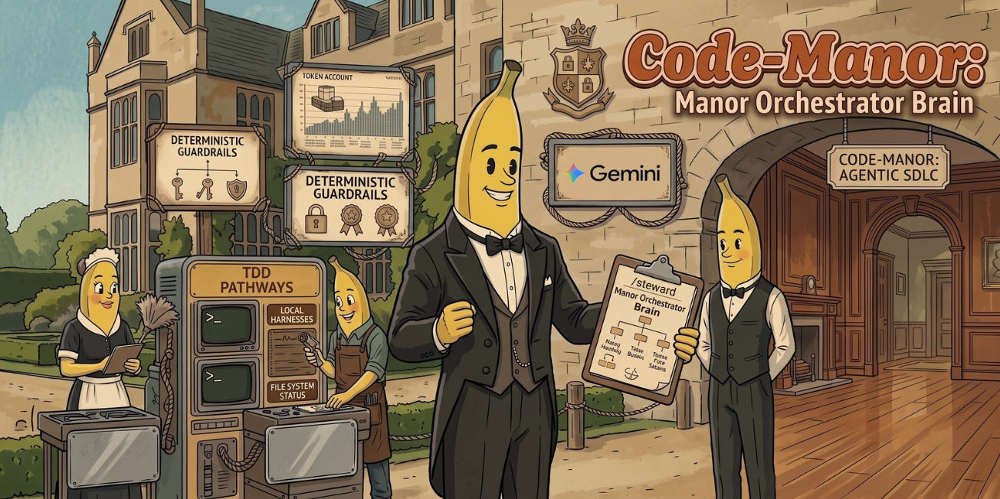

# 🏰 Code-Manor

<p align="center">
  <strong>The Universal Multi-Project Agentic Orchestration Distro</strong><br>
  <em>Unifying Matt Pocock's Cognitive Domain Craft with Kun Chen's Principal AXI Systems Engineering & Deterministic Gates</em>
</p>

<p align="center">
  
  
  
</p>

---



## 🎩 What is Code-Manor?

Most AI coding setups suffer from two crippling failure modes:
1. **The Vibe Coding Trap:** Letting agents write code unguided, leading to hallucinations, broken tests, and context rot.
2. **The Tab-Juggling Bottleneck:** Trying to juggle multiple repositories, copy-pasting diffs, and drowning in terminal noise.

**Code-Manor** solves this by establishing a disciplined, British household estate hierarchy (**Steward $\rightarrow$ Butler $\rightarrow$ Maid**), designed for high-leverage agentic software development:

```
                      👑 HUMAN (Master of the Estate)
                                    │
                                    ▼
                      🎩 /steward (Grand Conductor)
                         • Multi-Project Portfolio
                         • Zero-Search projects.json
                         • Context Insulation
                                    │
             ┌──────────────────────┴──────────────────────┐
             ▼                                             ▼
   🎩 /butler (Project A)                        🎩 /butler (Project B)
      • frontier-axi (Cognitive Bridge)             • frontier-axi (Cognitive Bridge)
      • tasks-axi DAG (Execution)                   • tasks-axi DAG (Execution)
      • .memory/ Architecture                       • .memory/ Architecture
      • /to-tickets Decomposition                   • /to-tickets Decomposition
      • Two-Axis Code Review                        • Two-Axis Code Review
             │                                             │
             ▼                                             ▼
      🧹 maid (Subagent)                            🧹 maid (Subagent)
         • /tdd (Test-First)                           • /tdd (Test-First)
         • no-mistakes Gate                            • no-mistakes Gate
         • Zero Test Tampering                         • Zero Test Tampering
```

---

## 💻 Cross-Platform & Dependency Guide

Code-Manor is engineered to run seamlessly across **macOS, Linux, and Windows**:

### 1. macOS & Native Linux
On macOS and Linux, all tools run natively in your default terminal:
- **Prerequisites:** `git`, `gh` (authenticated via `gh auth login`), Node.js (>= 20).
- **Core AXI Tools:**
  ```bash
  # Install tasks-axi, frontier-axi, and AXI CLI tools
  npm install -g tasks-axi frontier-axi lavish-axi gh-axi chrome-devtools-axi
  
  # Install no-mistakes gatekeeper
  curl -fsSL https://kunchenguid.github.io/no-mistakes/install.sh | bash
  ```
- **Execution:** All commands (`frontier-axi list`, `tasks-axi ready`, `no-mistakes axi run`, etc.) execute directly.

---

### 2. Windows + WSL2 (Windows Subsystem for Linux)
For Windows users, Code-Manor provides a seamless bridge between Windows IDEs/Agents (like Google Antigravity) and Linux-native CLI tools:
- **Prerequisites:** WSL2 (Ubuntu 22.04/24.04 recommended), Git, Node.js.
- **Tool Location:** Install `frontier-axi`, `tasks-axi`, and `no-mistakes` inside your WSL2 environment:
  ```bash
  npm install -g tasks-axi frontier-axi || npm install -g https://github.com/oguzalp7/frontier-axi.git
  ```
- **Bridge Mechanics:**
  - When running from a Windows host agent, commands are bridged transparently via `wsl <command>`:
    ```powershell
    wsl frontier-axi list
    wsl tasks-axi ready
    wsl no-mistakes axi run --skip ci
    ```
  - Paths are automatically translated between Windows (`C:\Users\...`) and WSL (`/mnt/c/Users/...`).
  - `/setup-code-manor` automatically detects Windows + WSL and configures the `projects.json` fleet registry with both path formats.

---

## 🤖 Harness Compatibility

Code-Manor is **harness-agnostic** and operates cleanly across all major agent environments:

| Harness | Primary Support Mode | Notes |
| :--- | :--- | :--- |
| **Google Antigravity** | Native Plugin | Auto-discovered from `~/.gemini/config/plugins/code-manor`. Native support for `Workspace: "branch"` and `projects.json`. |
| **Claude Code** | Official Plugin / Skills | Install via `npx skills@latest add oguzalp7/code-manor` or copy to `.claude/skills`. |
| **OpenAI Codex** | Native Agent YAML | Bundled `agents/openai.yaml` files provide model-invocation policies. |
| **Grok / Pi / Cursor** | Agent Distro | Compatible with standard subagent and terminal invocation flows. |

---

## ⚡ Quick Start

### 1. Installation

Install via universal Agent Skills:
```bash
npx skills@latest add oguzalp7/code-manor
```

Or clone directly into your Antigravity plugins directory:
```bash
# macOS / Linux:
git clone https://github.com/oguzalp7/code-manor.git ~/.gemini/config/plugins/code-manor

# Windows (PowerShell):
git clone https://github.com/oguzalp7/code-manor.git "$env:USERPROFILE\.gemini\config\plugins\code-manor"
```

### 2. Run Setup Wizard

In your agent chat, run:
```
/setup-code-manor
```
This will:
- Auto-discover registered projects from your IDE / desktop workspace storage.
- Populate `~/.gemini/antigravity/projects.json` for instant, zero-token project lookups.
- Verify environment toolchains (`tasks-axi`, `no-mistakes`, `git`, `gh`).

### 3. Talk to Your Estate

- **Across Projects:** Talk to `/steward` from any central or global conversation:
  - *"What did we build recently on Project PulseFlow?"*
  - *"Create a task graph connecting our API service to the mobile frontend."*
- **Inside a Specific Project:** Talk to `/butler` directly from a project workspace:
  - *"Grab the next unblocked ticket from tasks-axi ready and dispatch a maid to implement it."*

---

## 🛡️ Non-Negotiable Guardrails

1. **Zero-Tolerance Test Tampering:** Modifying existing test assertion lines in `tests/` or removing tests to force green is strictly prohibited. Green tests must be achieved exclusively by fixing implementation files in `src/`.
2. **Single Source of Truth (SSOT) Duality:** 
   - **Upstream Cognitive Frontier:** Nascent ideas, horizontal architectural seams, and foggy decisions live exclusively in `frontier-axi` (`.frontier.toml` / `frontier.md`). Prematurely dumping vague tickets directly into `tasks-axi` is strictly forbidden.
   - **Bridge to Slices:** Settle open questions via `/grilling` $\rightarrow$ formalize seams via `/to-spec` $\rightarrow$ slice into tracer bullets via `/to-tickets` $\rightarrow$ register in `tasks-axi` (or run `frontier-axi promote <id>` for isolated atomic spikes).
   - **Downstream Execution Backlog:** Verifiable vertical slices live in `tasks-axi` (`.tasks.toml` / `backlog.md`). Architectural memory lives in `.memory/`. Loose `TODO.md` files are banned.
3. **Context Pointers:** Conversations communicate through structured specs paired with conversation pointers (`conversation://<id>`). If an agent hits ambiguity, it uses targeted `grep` on `transcript.jsonl` rather than bloating the context window with raw history.
4. **Deterministic Outer Gate:** Every ticket must exit with code 0 from `no-mistakes axi run --skip ci` before Butler accepts it.

---

## 📦 What's Included (45 Skills)

- **Core Orchestrators & Pre-Flight Bridges:** `/steward`, `/butler`, `/frontier-axi`, `/setup-code-manor`.
- **Upstream Matt Pocock Skills (v1.2.3):** `/ask-matt`, `/to-spec`, `/to-tickets`, `/implement`, `/implement-spec`, `/retro`, `/tdd`, `/code-review`, `/diagnosing-bugs` (secret redacted), `/codebase-design`, `/improve-codebase-architecture`, `/wayfinder`, `/prototype`, `/wizard`, `/grill-with-docs`, `/grill-me`, `/grilling`, `/wait-what`, `/to-questionnaire`.
- **Kun Chen AXI & Verification Tools:** `frontier-axi` (pre-flight cognitive bridge), `frontend-axi-tdd` (zero-vision token UI testing), `/kun` (living L8 Principal knowledge base).
- **UI/UX Excellence:** `ui-ux-pro-max`, `frontend-design`.

---

## 📜 License

MIT © Oguz Alp
