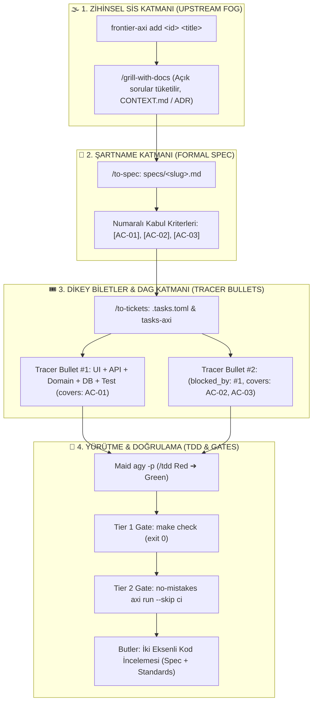

# 🏰 Code-Manor Tanıtım Videosu: Müfredat, Sahne Planı (Storyboard) ve Prodüksiyon Senaryosu

> **Sürüm:** 1.2 (Prodüksiyon Rehberi — Matt Pocock Taksonomisi & Dikey Dilimleme Mimarisi Genişletildi)  
> **Konsept:** "Vibe Coding İllüzyonundan L8 Mühendislik Disiplinine: Code-Manor Mimarisi & Canlı Walkthrough"  
> **Süre Hedefi:** ~14-18 Dakika (5-6 Dk Teori & İnteraktif Sunum + 9-12 Dk Doğaçlama Canlı Walkthrough)  
> **Sunum Dosyası:** [docs/slides.html](./slides.html) (10 Slaytlık İnteraktif Tailwind CSS Desteği)

---

## 🧭 Bölüm 1: Video Prodüksiyon Müfredatı (Curriculum)

---

### 📚 Modül 1: Kanca (The Hook) & Sektörel Problem
- **Problem 1 (Vibe Coding Çıkmazı):** Tek bir prompt ile "bana bu özelliği yaz" denildiğinde LLM'in 15 dosyayı birden değiştirmesi, var olan testleri gizlice silerek geçirmeye çalışması (test tampering) ve geriye bakımı imkansız bir spagetti bırakması.
- **Problem 2 (Terminal Kaosu ve Sekme Dansı):** 5 farklı repo arasında kaybolan, sürekli diff kopyalayıp yapıştıran, RAM'de unutulmuş zombi alt-süreçlerle (runaway background daemons) boğuşan geliştirici çaresizliği.
- **Çözüm:** Disiplinli bir işletim protokolü: **Code-Manor**.

---

### 📚 Modül 2: Matt Pocock Felsefesi ve `/ask-matt` Mimarisi

#### 1. Zihinsel Sis (Cognitive Fog) vs. Yürütme (Execution)
- İnsan beynindeki fikirler ilk başta "sisli" ve belirsizdir.
- LLM'e sisli bir talimat verirseniz, o da sisli ve spekülatif binlerce satır kod yazar.
- Pocock felsefesi: *Önce zihinsel sisi dağıt, etki alanı modelini (domain model) kur, açık soruları cevapla, sonra koda dokun.*

#### 2. Yatay Katmanlar (Horizontal Silos) Neden AI İçin Felakettir?
- Geleneksel yazılım yaklaşımlarında işler yatay katmanlara bölünür:
  1. Önce tüm veritabanı tabloları ve migration'lar
  2. Sonra tüm API route'ları ve controller'lar
  3. Sonra tüm iş mantığı servisleri
  4. En son tüm frontend ekranları
- **Neden Yapay Zekada Çöker?**
  - **Devasa Etki Alanı (High Blast Radius):** Model bir katmanı yazarken diğerlerini tahmin etmek zorundadır.
  - **Sıfır Ara Doğrulama (No Intermediate Verification):** En son güne kadar hiçbir şey çalışmaz ("Big Bang Entegrasyonu").
  - **Context Rot:** Model tüm sistemin soyutlamalarını tek bir bağlam penceresinde tutamaz ve halüsinasyona başlar.

#### 3. Dikey Dilimler (Vertical Slices / Tracer Bullets)
- Katman katman yatay iş bölmek yerine; en tepedeki UI'dan en alttaki DB ve testine kadar dar ama eksiksiz bir koridor kesilir.
- **Örnek Tracer Bullet #1:** "Kullanıcı şifre sıfırlama e-postası isteyebilsin":
  - `UI:` Basit talep formu ve submit butonu
  - `API:` `POST /auth/password-reset` endpoint'i
  - `Domain:` Token üretim servisi ve süre aşımı kuralları
  - `DB:` `password_reset_tokens` tablosu / şeması
  - `Test:` Uçtan uca ve birim testi
- **Faydaları:**
  - Tek bir fresh context penceresine (**Smart Zone &lt;180k token**) sığar.
  - Her bilet tek başına derlenir, tek başına test edilir ve deploy edilebilir.

#### 4. Biletleme Mimarisi & Bağımlılık Grafı (DAG)
- **Kabul Kriterleri (Acceptance Criteria):** `/to-spec` aşamasında her gereksinim numaralandırılır: `[AC-01]`, `[AC-02]`, `[AC-03]`.
- **Zero-Orphan Kuralı:** Şartnamedeki hiçbir kriter açıkta bırakılamaz. `/to-tickets` bu kriterleri biletlere %100 kapsama oranıyla paylaştırır (`covers: ["AC-01", "AC-02"]`).
- **Blokaj Ağı (Blocking Edges):** Her bilet sadece kendisini doğrudan engelleyen biletleri deklare eder (`blocked_by = ["T-01"]`). Bir bilet kapandığında bağımlı bilet anında `tasks-axi ready` durumuna geçer.

---

### 📚 Modül 3: Axi Ekosistemi & Deterministik CLI Araçları
Axi ekosistemi, Kun Chen'in (L8 Principal Systems Architect) sistem mühendisliği yaklaşımından doğmuştur: **Sıfır API token maliyeti, yerel dosya tabanlı (TOML/Markdown) deterministik SSOT.**

1. **`frontier-axi`:** Pişmemiş fikirler, açık mimari sorular ve tartışmalar (`.frontier.toml` & `frontier.md`).
2. **`tasks-axi`:** Netleşmiş, test edilebilir dikey dilimlerin yürütme kuyruğu (`.tasks.toml` & `backlog.md`).
3. **`no-mistakes` (Deterministik Doğrulama Bekçisi):**
   - Anti-Tampering: Test dosyalarında yetkisiz değişiklik ve satır silinmelerini engeller.
   - Tier 1: Projenin zorunlu `make check` komutunun `exit 0` vermesini garanti eder.
   - Diff/Invariant denetimi: İstenmeyen dosya sızıntılarını durdurur.
4. **GitHub CLI (`gh`):** Doğrudan resmi GitHub CLI kullanılır (`gh pr checks --watch`). Ekstra `gh-axi` soyutlamasına gerek yoktur.

---

### 📚 Modül 4: Code-Manor Malikane Hiyerarşisi
- 👑 **Master / İnsan:** Baş Mimar & **START BUTTON** (Kota/bütçe denetimi, yürütme izni).
- 🎩 **Steward (`/steward`):** Portföy Şefi. Çoklu reponun üst koordinatörü (`projects.json`).
- 🎩 **Butler (`/butler`):** Proje Kahyası (High Reasoning). Şartname yazar, bilet dağıtır, iki eksenli kod inceler. **Zero-Self-Code: Asla kendisi kod yazmaz!**
- 🧹 **Maid (`maid`):** Frugal CLI alt-süreci (`agy -p`). İzole worktree'de TDD ile kırmızı testi yeşile çevirir, `exit 0` ile RAM'den çıkar.

---

### 📚 Modül 5: Sorumluluk Reddi (Disclaimer)
> [!WARNING]
> Code-Manor sihirli bir peri değneği değildir. Kötü bir mimariyi veya belirsiz bir fikri tek başına kurtaramaz. Disiplinli mühendislerin elinde bir güç çarpanıdır.

---

### 📚 Modül 6: Canlı Video Walkthrough (Doğaçlama / Unscripted)
- Yarım kalmış gerçek bir projeyi devralmak.
- `tasks-axi ready` ile işi görmek, `/butler` ile devralmak, Maid'in TDD ile kodu yazması, `no-mistakes` denetimi ve canlı `gh pr checks --watch` ile GitHub Actions CI takibi.

---

## 🎬 Bölüm 2: Yenilenmiş Sahne Planı (Storyboard) & Zaman Çizelgesi

| Sahne No | Zaman Kodu | Slayt / Ekran | Sahne & Görsel İçerik | Konuşma / Seslendirme Özeti |
| :---: | :---: | :--- | :--- | :--- |
| **S1** | `00:00 - 00:45` | **Slayt 1 & 2** | Giriş, Vibe-Coding Çıkmazı & Test Tampering Diff Ekranı | "AI ile kod yazarken testlerinizin gizlice silindiğini fark ettiniz mi? Vibe-coding neden tıkanıyor?" |
| **S2** | `00:45 - 01:30` | **Slayt 3** | Matt Pocock Genel Bakış & 3 Temel Sütun | "Matt Pocock felsefesi: Zihinsel sis koda dökülmez. Ask-Matt taksonomisi, dikey dilimler ve TDD." |
| **S3** | `01:30 - 02:45` | **Slayt 4** | **Yatay Katmanlar vs. Dikey Dilimler (Architecture Matrix)** | "Neden yatay katmanlar (sadece DB, sadece API) AI için felakettir? Tracer Bullet dikey dilimi tabandan tavana nasıl kesilir?" |
| **S4** | `02:45 - 03:45` | **Slayt 5** | **Ask-Matt: Sis'ten Biletleme Grafına (DAG & Zero-Orphan)** | "Fikir şartnameye nasıl döner? [AC-01] kriterleri biletlere nasıl paylaştırılır? Zero-Orphan ve Blocking Edges kuralları." |
| **S5** | `03:45 - 04:45` | **Slayt 6 & 7** | Axi Ekosistemi & "no-mistakes" Doğrulama Kapısı | "Token yakmayan yerel TOML/Markdown SSOT. `no-mistakes` ajanları nasıl hizaya sokar? `gh` CLI tercihi." |
| **S6** | `04:45 - 05:45` | **Slayt 8 & 9** | Malikane Hiyerarşisi & Uçtan Uca Mühendislik Akışı | "Human (Start Button), Steward, Butler (Zero-Self-Code), Maid. Adım adım teslimat hattı." |
| **S7** | `05:45 - 06:30` | **Slayt 10** | Sorumluluk Reddi (Disclaimer) & Walkthrough Geçişi | "Sihir vaat etmiyoruz, disiplinli mühendislik sunuyoruz. Slaytları kapatıp canlı terminale geçiyoruz." |
| **S8** | `06:30 - 15:00` | **Canlı Terminal** | Terminal, Antigravity IDE, `tasks-axi ready`, `/butler`, `maid`, CI | "Yarım kalmış gerçek bir projeyi devralma. Doğaçlama canlı TDD, no-mistakes denetimi ve GitHub Actions takibi." |

---

## 🎙️ Bölüm 3: Matt Pocock ve Biletleme Özel Seslendirme Notları (Slides 4 & 5)

### [Slayt 4: Yatay Katmanlar vs. Dikey Dilimler]
*(Ekran: Solda kırmızı 'Horizontal Silos', sağda yeşil/mavi 'Tracer Bullets')*  
**Konuşmacı:**  
"Burada geleneksel yazılım alışkanlıklarımızla yapay zekanın doğası arasında çok ciddi bir çatışma var.  
Geleneksel olarak nasıl düşünürüz? 'Önce şu özelliğin tüm veritabanı tablolarını yazalım, sonra tüm API route'larını yazalım, sonra servisleri ve en son UI'ı bağlarız.'  
İşte bu yatay katmanlama mantığı, yapay zeka ajanları için tam bir felakettir!  
Çünkü model bir katmanı yazarken diğer katmanları kafasında uydurmak zorundadır. Hiçbir ara durum tek başına derlenemez ve test edilemez. Son gün geldiğinde her şey birbirine girer; buna 'Big Bang Entegrasyonu' diyoruz.  
Matt Pocock'un dikey dilimleme mimarisi burada devreye giriyor. Biz işi yatay değil, **dikey olarak (Tracer Bullet)** kesiyoruz.  
En tepedeki kullanıcı arayüzünden en alttaki veritabanı tablosuna kadar dar ama eksiksiz bir koridor açıyoruz. Örneğin: 'Kullanıcı şifre sıfırlama talebi gönderebilsin.' Formundan API'sine, token servisinden birim testine kadar hepsi tek bir dilimdir. Tek başına derlenir, tek başına yeşile döner ve modelin 180 bin tokenlık akıllı çalışma bölgesine (Smart Zone) sığar."

### [Slayt 5: Ask-Matt: Sis'ten Biletleme Grafına (DAG)]
*(Ekran: 4 adımlı akış şeması ve sağ altta .tasks.toml bilet anatomisi)*  
**Konuşmacı:**  
"Peki bu dilimler kafamızdaki sisli fikirlerden görev biletlerine nasıl dönüşüyor?  
İşte `/ask-matt` taksonomisinin kalbi burasıdır:  
1. Önce zihinsel sisi `frontier-axi` ve `/grill-with-docs` ile sorgularız. Token ömrü ne kadar? Magic link mi 6 haneli OTP mi? Açık hiçbir soru kalmayana kadar insan mimar grill edilir.  
2. Kararlar kilitlendiğinde `/to-spec` çalışır ve bunlar numaralı kabul kriterlerine (`[AC-01]`, `[AC-02]`) dökülür.  
3. Ardından `/to-tickets` devreye girer ve bu kriterleri dikey biletlere paylaştırır.  
Burada iki tavizsiz kuralımız var:  
İlki **Zero-Orphan Kuralı**. Şartnamedeki hiçbir kabul kriteri açıkta kalamaz; her kriter en az bir bilete atanmak zorundadır.  
İkincisi ise **Bağımsız Bağımlılık Grafı (DAG)**. Her bilet kimi beklediğini (`blocked_by`) açıkça ilan eder. Bir bilet kapandığı an, onu bekleyen bilet otomatik olarak yürütmeye hazır (`tasks-axi ready`) hale gelir.  
Böylece ajan asla kendi kafasına göre 'TODO' uyduramaz."
