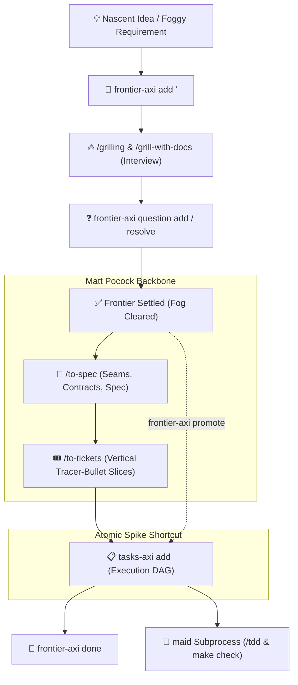

# 🧭 frontier-axi — Pre-Flight Cognitive Bridge & Frontier Tracking

**`frontier-axi`** is the upstream staging lounge for cognitive state in the **Code-Manor** orchestration hierarchy. It captures nascent ideas, horizontal architectural seams, and "foggy" decisions, providing a persistent home for open questions **before** they graduate into actionable code execution.

---

## 🎯 1. The Problem: The Vague Ticket Paradox

In agentic software development, teams face two opposing risks:
1. **Premature Ticket Creation:** Dumping vague, unrefined ideas directly into `tasks-axi` causes implementer subagents (`maid`) to hallucinate, write irrelevant tests, and drift off course.
2. **The Chat Memory Trap:** Leaving fuzzy ideas only in ephemeral chat dialogue means context compaction (`/compact`) or session resets wipe them out, destroying the architectural *why*.

**`frontier-axi` resolves this paradox:** It serves as the **upstream staging lounge**. Ambiguous topics and open inquiries are persisted deterministically without polluting the executable backlog.

---

## ⚖️ 2. The Duality: `frontier-axi` vs `tasks-axi`

`frontier-axi` and `tasks-axi` are complementary twin pillars:

| Dimension | 🧭 `frontier-axi` | 📋 `tasks-axi` |
| :--- | :--- | :--- |
| **Slicing Nature** | **Horizontal Slices:** Open-ended architectural decisions, data model selections, test seams, systemic ambiguities. | **Vertical Slices:** End-to-end testable tracer-bullet work packages (schema $\rightarrow$ API $\rightarrow$ UI $\rightarrow$ Test). |
| **Lifecycle Phase** | **Pre-Flight (Exploration & Design):** Brainstorming, `/grilling`, and design tree traversal before code is written. | **In-Flight (Execution & TDD):** Test-first implementation (`/tdd`), `make check`, and `no-mistakes` verification gates. |
| **Task Nature** | *"Decisions & Inquiries"* (Decisions & Open Questions) | *"Deliverables"* (Verifiable Code & Tests) |
| **Storage (SSOT)** | `.frontier.toml` and `frontier.md` | `.tasks.toml` and `backlog.md` |
| **Primary Actor** | Human Master + Conductors (`/steward`, `/butler`) | Implementer Subprocess Worker (`maid`) |

---

## 🔄 3. Holistic Lifecycle & Workflow



### Flow Steps:
1. **Stage the Topic:** Initialize foggy or research-heavy topics with `frontier-axi add <id> "<title>"`.
2. **Sharpen Cognitively:** Conduct iterative interviews with the human via `/grill-with-docs` (or `/grill-me`).
   - Log emergent questions: `frontier-axi question add <id> "<question>"`.
   - Resolve settled questions: `frontier-axi question resolve <id> <index> --answer "<answer>"`.
3. **Spec & Slice:**
   - **Large / Multi-Session Features:** Once the fog clears, formalize seams and write the spec with **`/to-spec`**, then decompose into vertical slices with **`/to-tickets`** and register them in `tasks-axi`.
   - **Atomic / Single Spikes:** Run `frontier-axi promote <id>` directly to synthesize a single `tasks-axi` ticket.
4. **Execution:** Query unblocked tickets via `tasks-axi ready` and delegate to `maid` subprocess worker.

---

## 💻 4. CLI Command Reference

`frontier-axi` is built on `axi-sdk-js` and conforms to AXI Standards (TOON format, Smart Zone token frugality):

### 1. Dashboard & Listing
Running without arguments summarizes active cognitive state:
```bash
# Summary table of active frontiers
frontier-axi

# List view
frontier-axi list
```

### 2. Topic Creation & Inspection
```bash
# Stage a new foggy architectural topic
frontier-axi add auth-seam "Determine session store seam vs JWT" --body "Redis vs JWT cookies comparison"

# Inspect topic details and open questions
frontier-axi show auth-seam --full
```

### 3. Question Management (Grilling Integration)
```bash
# Log an open architectural question
frontier-axi question add auth-seam "Will we support multi-region session invalidation?"

# Resolve a question with recorded decision
frontier-axi question resolve auth-seam 1 --answer "Yes, via Redis pub/sub."
```

### 4. Promotion (Cognitive Bridge)
Promotes a settled frontier topic directly into a `tasks-axi` ticket:
```bash
# Dry-run simulation
frontier-axi promote auth-seam --dry-run

# Promote directly into tasks-axi backlog
frontier-axi promote auth-seam --kind ship --priority 1
```

### 5. Resolution & Archival
```bash
# Mark as completed/settled
frontier-axi done auth-seam --reason "Settled in ADR-004 and split via /to-spec"

# Cancel out-of-scope topic
frontier-axi cancel auth-seam --reason "Out of scope"
```

---

## 🌉 5. Cross-Platform Execution (Native & WSL)

- **macOS & Linux (Native):**
  ```bash
  frontier-axi list
  frontier-axi show <id>
  ```
- **Windows (WSL Bridge):**
  ```powershell
  wsl frontier-axi list
  wsl frontier-axi show <id>
  ```

---

## 📦 6. Installation & Updates

```bash
# Global installation (via npm or GitHub repository)
npm install -g frontier-axi || npm install -g https://github.com/oguzalp7/frontier-axi.git
```
