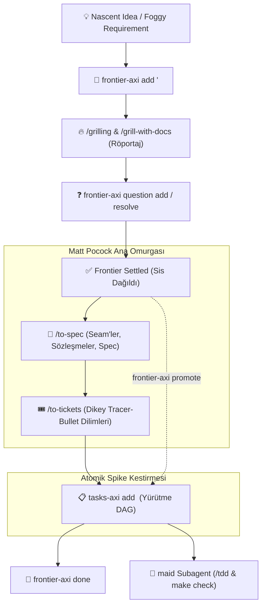

# 🧭 frontier-axi — Pre-Flight Cognitive Bridge & Frontier Tracking

**`frontier-axi`** is the upstream staging lounge for cognitive state in the **Code-Manor** orchestration hierarchy. It captures nascent ideas, horizontal architectural seams, and "foggy" decisions, providing a persistent home for open questions **before** they graduate into actionable code execution.

---

## 🎯 1. The Problem: The Vague Ticket Paradox

In agentic software development, teams face two opposing risks:
1. **Premature Ticket Creation:** Dumping vague, unrefined ideas directly into `tasks-axi` causes implementer subagents (`maid`) to hallucinate, write irrelevant tests, and drift off course.
2. **The Chat Memory Trap:** Leaving fuzzy ideas only in ephemeral chat dialogue means context compaction (`/compact`) or session resets wipe them out, destroying the architectural *why*.

**`frontier-axi` resolves this paradox:** It serves as the **upstream staging lounge**. Ambiguous topics and open inquiries are persisted deterministically without polluting the executable backlog.

---

## ⚖️ 2. The Duality: `frontier-axi` vs `tasks-axi`

`frontier-axi` and `tasks-axi` are complementary twin pillars:

| Dimensiyon | 🧭 `frontier-axi` | 📋 `tasks-axi` |
| :--- | :--- | :--- |
| **Dilimleme Türü** | **Yatay Dilimler (Horizontal Slices):** Ucu açık mimari kararlar, veri modeli seçimleri, test dikişleri (seams), sistemik belirsizlikler. | **Dikey Dilimler (Vertical Slices):** Uçtan uca test edilebilir tracer-bullet iş paketleri (schema $\rightarrow$ API $\rightarrow$ UI $\rightarrow$ Test). |
| **Aşama** | **Pre-Flight (Keşif & Tasarım):** Kod yazılmadan önceki beyin fırtınası, `/grilling` ve tasarım ağacı süreci. | **In-Flight (Yürütme & TDD):** Test-first geliştirme (`/tdd`), `make check` ve `no-mistakes` doğrulama kapıları. |
| **Görev Niteliği** | *"Kararlar"* (Decisions & Open Questions) | *"Teslim Edilebilirler"* (Verifiable Deliverables) |
| **Depolama (SSOT)**| `.frontier.toml` ve `frontier.md` | `.tasks.toml` ve `backlog.md` |
| **Kullanıcı / Aktör**| Human Master + Conductor (`/steward`, `/butler`) | Implementer Worker (`maid`) |

---

## 🔄 3. Bütünsel Yaşam Döngüsü & İş Akışı



### Akış Adımları:
1. **Konuyu Sahneye Al (Stage):** Sisli veya araştırma gerektiren konuyu `frontier-axi add <id> "<title>"` ile başlatın.
2. **Bilişsel Keskinleştirme (Sharpen):** `/grill-with-docs` (veya `/grill-me`) ile insanla turlar halinde röportaj yapın.
   - Ortaya çıkan soruları `frontier-axi question add <id> "<question>"` ile kaydedin.
   - Karara bağlananları `frontier-axi question resolve <id> <index> --answer "<answer>"` ile çözün.
3. **Şartnameye ve Biletlere Dönüştür (Spec & Slice):**
   - **Büyük / Çok Oturumlu Özellikler:** Sis dağıldığında **`/to-spec`** ile test dikişlerini ve şartnameyi yazın, ardından **`/to-tickets`** ile dikey dilimlere ayırıp `tasks-axi`'ye ekleyin.
   - **Atomik / Tekil Spike'lar:** Doğrudan `frontier-axi promote <id>` çalıştırarak tekil bir `tasks-axi` bileti sentezleyin.
4. **Yürütme:** `tasks-axi ready` ile sıradaki bileti `maid` subagent'ına devredin.

---

## 💻 4. CLI Komut Referansı

`frontier-axi`, `axi-sdk-js` üzerine kuruludur ve AXI Standartlarına (TOON formatı, Smart Zone token tasarrufu) tam uyumludur:

### 1. Dashboard & Liste
Argümansız çalıştırıldığında aktif bilişsel durumu özetler:
```bash
# Aktif frontier özet tablosu
frontier-axi

# Liste formatında görüntüleme
frontier-axi list
```

### 2. Konu Ekleme & İnceleme
```bash
# Yeni bir sisli mimari konu aç
frontier-axi add auth-seam "Determine session store seam vs JWT" --body "Redis vs JWT cookies comparison"

# Konu detaylarını ve açık soruları incele
frontier-axi show auth-seam --full
```

### 3. Soru Yönetimi (Grilling Entegrasyonu)
```bash
# Açık bir mimari soruyu kaydet
frontier-axi question add auth-seam "Will we support multi-region session invalidation?"

# Soruyu cevaplayarak çözüldü olarak işaretle
frontier-axi question resolve auth-seam 1 --answer "Yes, via Redis pub/sub."
```

### 4. Terfi (Promote - Cognitive Bridge)
Açık sorular çözüldüğünde konuyu otomatik olarak `tasks-axi` biletine dönüştürür:
```bash
# Simülasyon (dry-run)
frontier-axi promote auth-seam --dry-run

# tasks-axi'ye aktar
frontier-axi promote auth-seam --kind ship --priority 1
```

### 5. Durum Kapatma & Arşiv
```bash
# Tamamlandı/çözüldü olarak işaretle
frontier-axi done auth-seam --reason "Settled in ADR-004 and split via /to-spec"

# İptal et
frontier-axi cancel auth-seam --reason "Out of scope"
```

---

## 🌉 5. Çapraz Platform Çalıştırma (Native & WSL)

- **macOS & Linux (Native):**
  ```bash
  frontier-axi list
  frontier-axi show <id>
  ```
- **Windows (WSL Bridge):**
  ```powershell
  wsl frontier-axi list
  wsl frontier-axi show <id>
  ```

---

## 📦 6. Kurulum & Güncelleme

```bash
# Global kurulum (npm veya GitHub repo üzerinden)
npm install -g frontier-axi || npm install -g https://github.com/oguzalp7/frontier-axi.git
```
